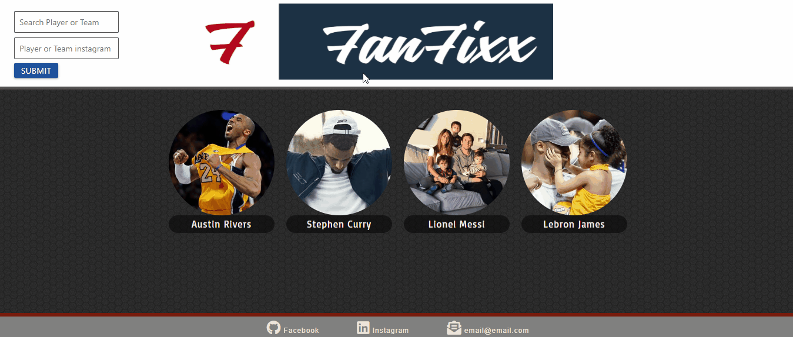

# Fanfixx

What every sports fan craves.

[See Fanfixx live!](https://mlipphardt.github.io/Fanfixx/)

## About Fanfixx

---

Fanfixx is a full-stack application which allows users easy access to player and team statistics, scheduling information, and social media feeds all from one easy-to-use application. No longer do users have to open up several browser tabs to look at everything they want to know about their favorite players and teams! Additionally, once a player's information is retrieved once, they remain on the user's dashboard and can be switched between with as little as a single click.

## Using Fanfixx

---

In order to use Fanfixx, begin by visiting the [site](https://mlipphard.github.io/Fanfixx).

To add a player to your dashboard and make their information available for retrieval, type their name and instagram handle into the search bar at the top of the page.

Once the player button has appeared on the page, clicking a button will bring up their record and scheduling on the left, and their instagram feed on the right. To see a different player's information, simply click on their picture.

---

## Installing Fanfixx locally

---

If desired, Fanfixx can be cloned to a local machine easily.

To do so, page the following links into your terminal:

Via SSH
`git@github.com:Mlipphardt/Fanfixx.git`

Via HTTPS
`https://github.com/Mlipphardt/Fanfixx.git`

Once cloned, simply opening index.html will start the application in your preferred browser.

---

## Building Fanfixx

---

Fanfixx is a collaborative application built by [Carolyn Grady](https://github.com/cgrady3/), [Jeff Gunderson](https://github.com/jgunderson819), and [Matthew Lipphardt](https://github.com/Mlipphardt).

Fanfixx employs the following technologies:

- Bootstrap and Materia for CSS styling.
- jQuery for dynamic alteration of page content and API requests.
- Google Firebase to store player names and avatars to populate the dashboard.
- [Instagram API](https://www.instagram.com/developer/) for the social media feed and the [SportsDB API](https://www.thesportsdb.com/api.php) for scheduling and score information.
